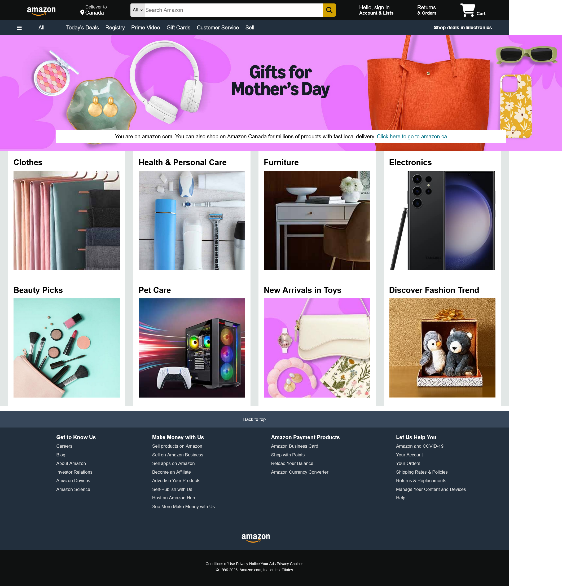

# Amazon-Clone
Amazon UI Clone - HTML/CSS Recreation   A responsive frontend clone of Amazon's homepage featuring the navigation bar, product showcase, and footer sections. Built with pure HTML and CSS as a learning project.No AI, no templates—just pure HTML/CSS. Learned flexbox, hover effects, and responsive layouts by dissecting Amazon’s UI.

A responsive clone of the Amazon website homepage built with HTML and CSS.

## Features

- Responsive navigation bar with hover effects
- Product showcase section with multiple categories
- Footer with multiple sections like the original Amazon site
- Uses Font Awesome for icons

## Technologies Used
- **HTML5** - Semantic structure
- **CSS3** - Flexbox, hover effects, responsive design
- **Font Awesome** - Icons

## How to Run

1. Clone this repository
2. Open `index.html` in your browser

## Project Structure
amazon-clone/
├── index.html
├── style.css
│── amazon_logo.png
│── mothers_day_.jpg
│── box1_image.jpg
│... (other images)
├── README.md            # Project documentation

## Screenshot

  
  
<em>Pixel-perfect clone built with HTML/CSS</em>

## Future Improvements

- Adding JavaScript functionality
- Making it fully responsive for mobile devices
- Adding more interactive elements
